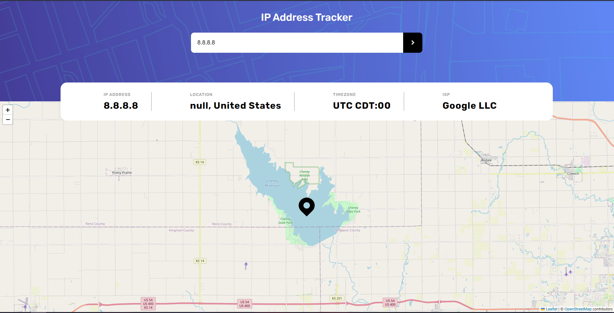

# IP Address Tracker

## The challenge

Users should be able to:

- View the optimal layout for each page depending on their device's screen size
- See hover states for all interactive elements on the page
- See their own IP Address on the map on the initial page load
- Search for any IP addresses or domains and see the key information and location

## Screenshot of the final solution

## Links

You can find my solution online at 

- Github pages [https://enzobocalon.github.io/frontend-ip-address/]

## Tools

- React and CSS3

## Author

- Enzo Bocalon [https://github.com/enzobocalon]
